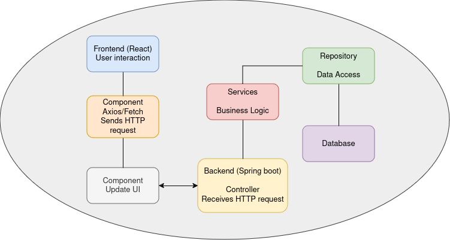

# Documentación de Prueba Tecnica

## Diagrama


## Base de datos MER


## Intrucciones para generar imagenes Docker y Crear contendores

Lo primero que debemos hacer es asegurarnos de que los puertos: 5432, 2024, y 3000 esten desocupados.

### Frontend
Para esto obviamente debes instalar docker sino esta instalado en la maquina.

### Dockerfile
``` yaml
ARG NODE_VERSION=lts-alpine
FROM node:${NODE_VERSION} AS build
WORKDIR /app
COPY package.json .

# Dependencies
RUN npm install
COPY nginx.conf .
COPY . /app

# Production Config
COPY config.prod.js /app/src/helpers/services/server.js

RUN npm run build

# Web Server
FROM nginx:stable-alpine-slim
COPY --from=build /app/build usr/share/nginx/html
COPY --from=build /app/nginx.conf /etc/nginx/conf.d/default.conf

#docker build -f Dockerfile.prod -t frontend .
#docker run -d -p 3000:80 --name frontend frontend
```

Iniciar la aplicacion Frontend
``` sh
cd frontend
docker compose up -d
```

Si deseas correrlo manual has com sigue:
``` sh
docker build -f Dockerfile -t frontend .
docker run -d -p 3000:80 --name frontend frontend
```

### Backend

``` yaml
# Usar una imagen base de OpenJDK
FROM openjdk:17-jdk-alpine

# Establecer el idioma
ENV LANGUAGE='en_US:en'

# Crear un directorio para la aplicación
VOLUME /tmp

# Copiar las dependencias y el archivo JAR de la aplicación
COPY target/*.jar app.jar

# Exponer el puerto en el que la aplicación se ejecuta
EXPOSE 2024

# Configurar el usuario para ejecutar el contenedor
USER 185

# Establecer las opciones de JVM
#ENV JAVA_OPTS="-Djava.security.egd=file:/dev/./urandom"

# Configurar el comando para ejecutar la aplicación
ENTRYPOINT ["java","-jar","/app.jar"]

```

Iniciar la aplicación backend

#### Nota:
Para ejecutar este es mejor correr el docker-compose ya que ahi esta configurado el servicio de base de datos postgres tambien.
``` sh
cd ../talycapglobal
docker compose up -d
```

### Acceso a los servicios

Despues de ejecutados los servcios correctamente, entonces procedemos a acceder a estos:

#### Frontend

Desde el navegador: http://localhost:3000

Para ver los endpoint rest funcional

http://localhost:2024/tasks

http://localhost:2024/priorities

http://localhost:2024/status